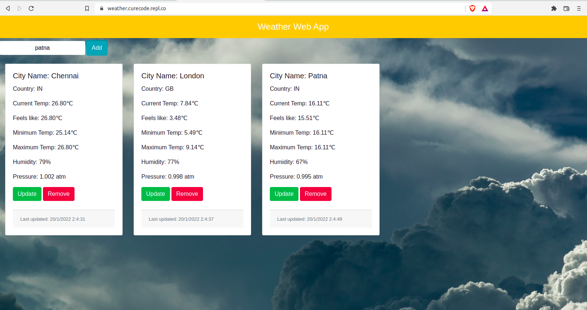

### Weather-Manager
#### Technology used
- HTML
- CSS
- Bootstrap
- VueJS

#### What is
You can manage weather of multiple time zone at a time right in the web browser

#### How to run
- Place your own openweather API key in line number 24 and 96 inside vuejs.js
- Open index.html in the browser

#### UI and live
- Live link : [Go](https://weather.curecode.repl.co/)
- Screenshot: 

###### Note: This is weekly project of Modern App Development 2 at IITM
